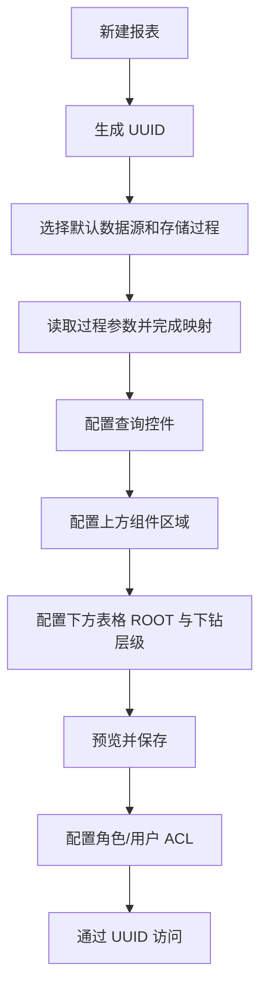
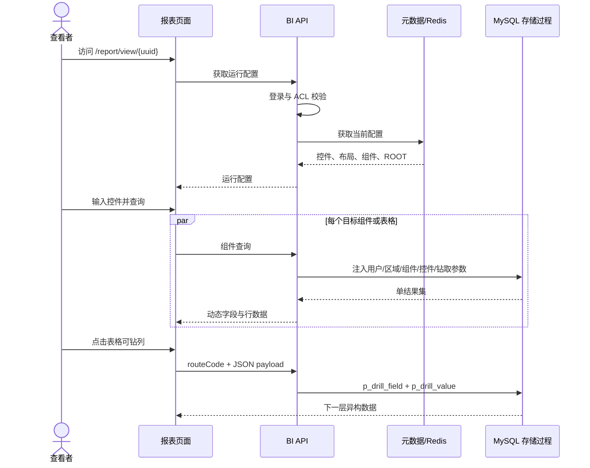

# SK BI 第一版产品需求文档

## 1. 产品定位

SK BI 是面向企业内部开发者和业务用户的 B/S 架构报表系统。每张报表由可选的“组件区域”和“表格区域”构成：上方组件区域展示图表或指标卡，下方表格区域展示可异构下钻的动态表格。两个区域独立取数，字段和业务含义无需相关。系统以 MySQL 存储过程作为数据集执行入口，并允许表格每个下钻层级拥有完全不同的字段结构，从而解决传统 BI 产品“上下层字段结构必须一致”的限制。

### 1.1 产品目标

1. 开发者无需修改前端代码即可创建报表、查询控件、组件、字段映射和下钻规则。
2. 一张报表通过 UUID 获得稳定访问地址，配置保存后无需重启即可生效。
3. 表格区域可从“日期、销售额”下钻到“日期、客户、销售员、销售额”等异构结构。
4. 存储过程统一处理业务计算和行级数据权限，前端负责展示、分页、排序和交互。
5. 支持上方多组件栅格、下方单表格、柱状图、折线图、指标卡、Excel 导出和整页打印。

### 1.2 非目标

第一版不建设通用数据建模平台、拖拽 SQL 生成器、移动端设计器、匿名分享、跨数据库数据集、控件级联、服务端分页排序或数据缓存平台。

## 2. 用户角色

| 角色 | 核心职责 | 默认权限 |
|---|---|---|
| 系统管理员 | 用户角色、数据源、平台参数、审计与运行监控 | 全部系统管理能力 |
| BI 开发者 | 创建报表、配置存储过程、控件、组件、层级与字段 | 被授权范围内的报表设计能力 |
| 报表查看者 | 查询、浏览、下钻、导出和打印 | 仅访问被角色或用户 ACL 授权的报表 |

角色是产品角色，不强制与若依内置角色名称一致；落地时通过权限标识和角色授权实现。

## 3. 功能范围

### 3.1 报表管理

- 新建报表时生成不可变 UUID；名称、描述、状态、默认数据源和默认存储过程可修改。
- 列表支持按名称、UUID、状态、创建人和更新时间查询。
- 报表支持启用、停用、复制和删除；删除采用逻辑删除，已删除 UUID 不复用。
- 启用报表的访问地址为 `/report/view/{uuid}`。
- 报表可授权给角色或指定用户；用户满足任一授权即允许访问。
- BI 开发者必须同时具有设计权限和目标数据源使用权限。

### 3.2 数据源管理

- 支持配置多个 MySQL 8、SQL Server 或 PostgreSQL 报表业务数据源，包括类型、名称、主机、端口、数据库、Schema、用户名、加密密码和连接参数；系统元数据库仍固定使用 MySQL，不随业务数据源类型变化。
- 支持连接测试和存储过程列表刷新。
- 仅系统管理员可以查看脱敏后的连接信息、修改凭据和执行连接测试。
- 业务数据源账号应使用最小权限，原则上仅授予读取元数据、执行指定存储过程和必要的只读查询权限。

### 3.3 查询控件

| 类型 | 值形态 | 主要配置 |
|---|---|---|
| 文本 | string | 默认值、必填、最大长度 |
| 单选 | scalar | 静态或 SQL 选项、默认值、可清空 |
| 多选 | JSON array | 静态或 SQL 选项、默认值、最大选择数 |
| 日期 | `YYYY-MM-DD` | 默认值、日期格式 |
| 日期范围 | start/end | 默认开始、默认结束、是否允许同日 |
| 数字 | number | 默认值、最小值、最大值、小数位 |
| 数字范围 | min/max | 默认范围、边界、小数位 |

- 控件属于报表，可作用于全部上方组件和下方表格，也可只选择指定目标。
- 每个目标对象分别配置控件到存储过程参数的映射。
- 日期范围映射到两个参数；多选映射为 JSON 数组字符串。
- SQL 选项来源第一版不引用其他控件，不形成级联关系；允许使用只读系统参数 `:currentUserId` 过滤用户可见选项。
- 点击“查询”后统一刷新受影响对象；上方组件和下方表格也可独立刷新。

### 3.4 报表区域与组件

- 每张报表至少启用一个区域，可以只有组件区域、只有表格区域，或两个区域同时存在。
- 组件区域固定在页面上方，使用桌面栅格，可包含一个或多个柱状图、折线图或指标卡；组件支持新增、复制、删除、拖动和缩放。
- 表格区域固定在页面下方，最多存在一个全宽主表格，不参与上方栅格拖拽。
- 每个上方组件和下方表格都有稳定且在报表内唯一的 `componentKey`；表格建议使用 `main_table`。
- `regionKey` 只有 `COMPONENT` 和 `TABLE`。`componentKey` 标识具体取数对象，与表格下钻字段和值没有业务依赖。
- 上方组件和下方表格默认继承报表的数据源和存储过程，也可分别覆盖；它们返回的字段和数据可以完全不同。
- 页面初始化时分别查询可见组件和表格；单个对象失败不阻塞其他区域。
- 图表直接使用存储过程返回的数据，不执行隐式分组或业务聚合。
- 指标卡读取配置字段第一行的值；无数据时显示 `--`。

### 3.5 表格层级、字段与异构下钻

- 启用表格区域时必须至少包含一个 `ROOT` 层级。
- 每个表格层级独立配置字段列表、格式化方式和钻取规则，展示类型固定为 `TABLE`。
- 字段支持物理名称、显示名称、类型、排序、显示、固定、宽度、对齐、格式和样式指示字段。
- 表格点击被配置的列进入目标层级；上方图表和指标卡第一版不参与表格下钻。
- 下钻只替换表格区域的数据和字段，上方组件状态不变。
- 表格区域显示一套面包屑；点击任意上级节点后重新查询该历史状态。
- 没有匹配钻取边的表格字段不可点击，不显示误导性链接样式。

### 3.6 样式

- 存储过程可返回隐藏样式字段，显示字段通过 `styleIndicatorField` 引用。
- 第一版只允许字体颜色和加粗，格式为 `#RRGGBB,bold` 或 `#RRGGBB,normal`。
- 空值采用默认样式；非法内容忽略并记录诊断日志，不允许作为 CSS 注入页面。

### 3.7 Excel 导出与打印

- 表格组件支持导出当前控件和钻取状态下已加载的全部行，而非仅当前分页。
- 整报表导出为一个工作簿：每个数据组件一个工作表，指标卡写入“概览”工作表。
- 工作表名称清理 Excel 非法字符并保证唯一，最多 31 个字符。
- 数据被截断时，导出前必须二次提示，工作簿中增加“数据已截断”说明。
- 打印当前报表状态下的完整仪表盘，隐藏编辑、查询和操作按钮；表格仅打印当前分页。

### 3.8 配置生效与回滚

- 每次保存必须在单个元数据库事务中完成：校验配置、更新当前数据、递增版本、保存版本快照。
- 事务提交后删除本实例 Redis 缓存并发布跨实例失效消息。
- 新请求必须在 2 秒内读取新配置；执行中的旧请求不强制中止。
- 回滚会把目标快照复制为一个新的当前版本，不覆盖或删除历史版本。

## 4. 核心业务流程

### 4.1 创建报表

### 4.2 查看与下钻

## 5. 业务规则

1. `p_user_id` 只能来自服务端登录上下文；请求体出现同名值时忽略并记录安全日志。
2. UUID 仅用于定位，任何配置和查询接口均必须再次校验报表 ACL。
3. 根层调用时 `p_drill_field=''`、`p_drill_value=NULL`。
4. 组件键、表格路由编码、字段物理名在各自作用域内唯一，创建后修改需进行引用完整性检查。
5. 缺少任何可见字段、载荷字段或样式指示字段时，本组件查询失败并给出配置诊断；额外未引用字段不返回前端。
6. 默认最多读取 50,000 行、超时 60 秒；报表值不得超过平台 200,000 行硬上限。
7. 达到行数限制时读取第 `limit + 1` 行用于判断截断，响应只保留前 `limit` 行。
8. 前端排序作用于已返回的全部行，随后分页；截断结果上的排序不代表数据库全量排序。
9. 停用、删除或无权访问的报表均不得通过 UUID 查询数据。

## 6. 验收摘要

- 无需改前端代码即可配置至少三层、每层字段结构不同的下方表格。
- 一个报表内可同时展示上方柱状图、折线图、指标卡和下方表格，并由同一存储过程通过区域键和组件键区分结果。
- 控件参数、登录用户、组件键和钻取 JSON 按配置正确传入存储过程。
- 保存和回滚配置后 2 秒内对新查询生效，无需重启。
- 角色和用户 ACL、导出、打印、截断提示、错误隔离均符合本文件规则。
- 完整测试矩阵见 [08-test-and-roadmap.md](08-test-and-roadmap.md)。
