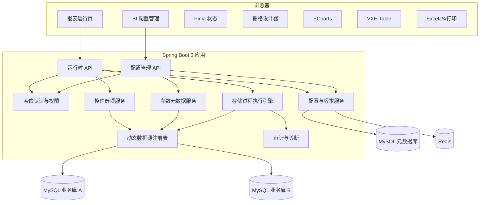
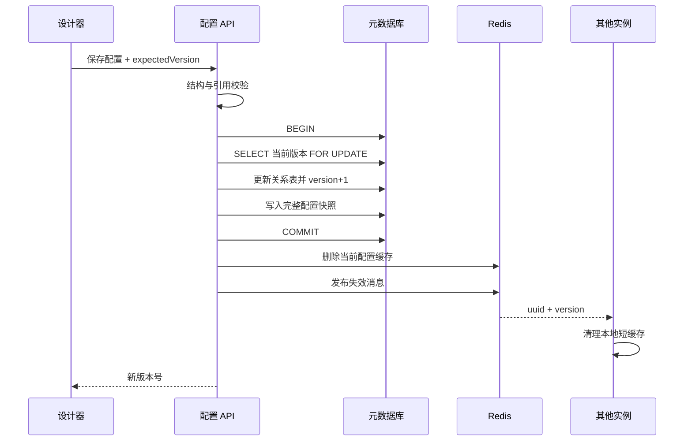
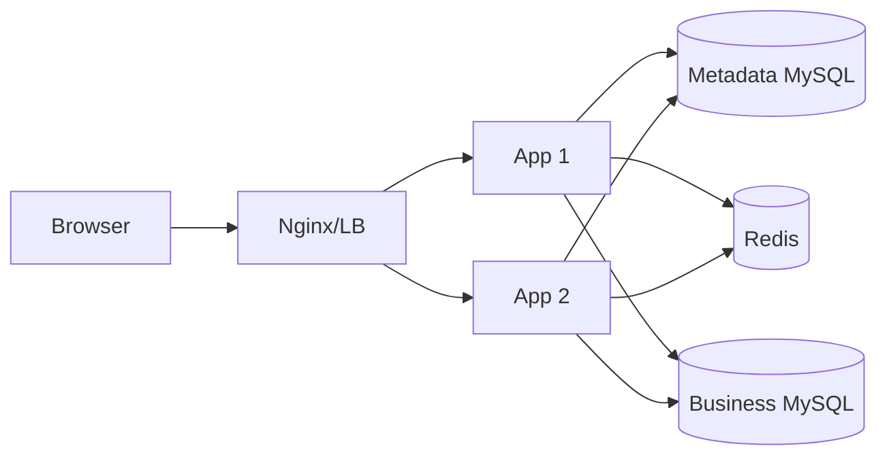

# 系统架构设计

## 1. 架构原则

- 使用若依提供登录、JWT、用户、角色、菜单、审计等通用后台能力，BI 作为独立业务模块接入。
- 配置元数据与业务查询数据分离；业务数据只在请求链路中流转，不落入元数据库和 Redis。
- 存储过程承担数据权限过滤和业务计算，Java 承担参数治理、权限校验、结果约束与动态映射。
- 前端不依赖固定表格字段 DTO，按照运行时字段定义渲染下方表格；上方组件按各自配置映射结果。
- 配置变更使用版本号和缓存失效实现热生效，不在服务内维护不可更新的静态配置。
- 单组件故障隔离，仪表盘允许局部失败、局部重试。

## 2. 总体架构



## 3. 模块边界

### 3.1 前端模块

| 模块 | 职责 |
|---|---|
| `bi-admin` | 报表、数据源、ACL、版本和参数映射管理 |
| `bi-designer` | 两区域开关、上方组件栅格、下方表格层级字段和可视化配置 |
| `bi-runtime` | 按 UUID 加载配置、维护控件、组件和表格状态、执行查询和表格下钻 |
| `bi-renderers` | 表格、柱状图、折线图、指标卡统一渲染接口 |
| `bi-export` | Excel 工作簿、文件名、截断说明与整页打印 |

每种渲染器接收统一的 `ComponentQueryResult`，不得直接调用后端或读取设计器内部状态。

### 3.2 后端模块

| 模块 | 职责 |
|---|---|
| 配置服务 | 配置 CRUD、校验、事务保存、版本快照、回滚和缓存失效 |
| 数据源服务 | 凭据加解密、连接池生命周期、连接测试和最小权限诊断 |
| 元数据服务 | 读取数据库、存储过程及 `INFORMATION_SCHEMA.PARAMETERS` |
| 参数绑定器 | 按过程签名将系统、区域、组件、控件、钻取、常量或空值转换为 JDBC 参数 |
| 查询执行器 | 超时、行数限制、单结果集读取、字段验证和数据类型序列化 |
| 控件选项服务 | 静态选项和受限 SQL 选项查询、短期缓存 |
| 权限服务 | 管理权限、报表 ACL、数据源使用权限和 `p_user_id` 注入 |
| 审计诊断 | 配置变更、连接测试、查询摘要、异常分类和敏感信息脱敏 |

## 4. 配置读取与热生效

### 4.1 缓存模型

- 当前版本键：`bi:report:current:{uuid}`，值为序列化后的完整运行配置，TTL 30 分钟并采用访问续期。
- 控件选项键：`bi:option:{controlId}:{userScopeHash}`，默认 TTL 60 秒。
- 缓存失效频道：`bi:config:invalidate`，消息包含 `uuid`、`version`、`eventId`。
- 不缓存报表查询结果，避免用户数据串用、陈旧和大对象占用 Redis。

### 4.2 保存事务



保存请求携带 `expectedVersion` 进行乐观锁校验；版本冲突返回 `BI_CONFIG_VERSION_CONFLICT`，前端提示重新加载，不自动覆盖他人修改。

## 5. 运行时查询链路

1. 校验 JWT、报表状态与用户/角色 ACL。
2. 从 Redis 或元数据库获得不可变运行配置快照。
3. 校验区域键、组件键、控件作用域；表格查询额外校验当前路由和钻取边。
4. 解析组件数据源和存储过程；组件未覆盖时使用报表默认值。
5. 从服务端安全上下文取得内部用户 ID，并加入 `region_key`、`component_key` 建立参数上下文。
6. 按已保存的存储过程签名序号绑定所有 IN 参数。
7. 设置 JDBC 查询超时并执行 CallableStatement。
8. 只接受第一个结果集；检测后续结果或 OUT/INOUT 配置时拒绝执行。
9. 最多读取 `effectiveLimit + 1` 行，判断截断后丢弃额外一行。
10. 根据当前层级字段配置校验必需物理字段，过滤未引用字段，生成响应。
11. 记录耗时、行数、截断、数据源和错误分类，不记录控件明文、SQL 结果或钻取载荷全文。

## 6. 并发与故障隔离

- 页面初始化分别查询上方可见组件和下方表格，默认最大并发 4；其余进入前端队列。
- 每个上方组件有独立的 `loading/error/data` 状态；下方表格另有独立的 `loading/error/data/breadcrumb` 状态和取消令牌。
- 新查询发起时取消同组件旧请求；即使后端无法中止数据库执行，旧响应也不得覆盖新状态。
- 数据源连接池按数据源 ID 隔离，停用或修改连接时先创建并验证新池，再原子替换旧池。
- 单组件异常以组件错误态呈现，保留“重试”和错误追踪号，不跳转全局错误页。
- 达到应用内存或并发保护阈值时返回繁忙错误，不继续分配大结果集。

## 7. 动态数据源

- 元数据库使用应用主数据源，不进入动态业务数据源注册表。
- 业务连接池以 `datasourceId + credentialVersion` 为缓存键。
- 凭据修改、数据源停用或删除后关闭旧连接池；正在使用的连接允许在宽限期内完成。
- 存储过程元数据读取和控件 SQL 查询复用同一业务连接池，但使用独立超时。
- 禁止通过请求参数直接提交 JDBC URL、数据库名或存储过程名。

## 8. 扩展接口

### 8.1 外部身份适配

```java
public interface ExternalIdentityProvider {
    ExternalIdentity authenticate(ExternalCredential credential);
    Optional<ExternalIdentity> resolve(String externalSubject);
}
```

第一版使用若依本地登录，该接口不改变现有登录入口。未来 ERP 接入时，将外部主体映射到内部用户 ID；传给 `p_user_id` 的仍是内部 ID，除非报表参数配置明确选择经审批的外部身份属性。

### 8.2 渲染器接口

```ts
export interface BiRendererProps {
  component: RuntimeComponent;
  route: RuntimeRoute;
  result: ComponentQueryResult;
  state: ComponentRuntimeState;
}
```

表格渲染器通过事件上报钻取，不直接拼装 `p_drill_field`；图表和指标卡渲染器第一版不产生表格钻取事件。页面编排层根据表格钻取边读取隐藏载荷字段。

## 9. 部署拓扑

第一版可单实例部署，但实现必须允许应用多实例：共享元数据库和 Redis，业务数据源独立。静态前端由 Nginx 或若依既有部署方式托管，API 使用同域反向代理以减少跨域配置。


