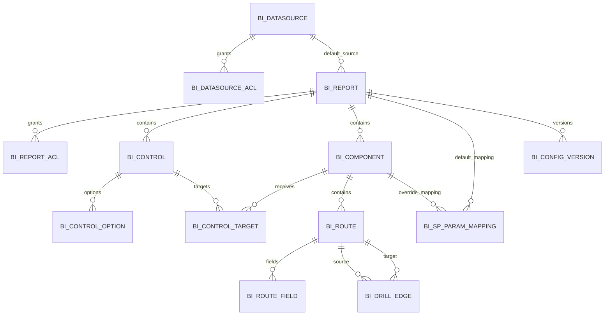

# 数据模型设计

## 1. 设计约定

- 元数据库使用 MySQL 8、InnoDB、`utf8mb4`。
- 主键统一为 `BIGINT`，由若依统一 ID 生成策略产生；报表对外标识使用 UUID。
- 时间统一以服务器时区写入 `DATETIME(3)`，API 输出 ISO 8601。
- `created_by`、`updated_by` 保存内部用户 ID；所有核心表包含创建、更新和乐观锁版本字段。
- 配置查询以关系表为主；只有布局、图表细项、控件扩展属性和版本快照使用 JSON。
- 业务上使用逻辑删除；DDL 中保留必要外键以表达关系。若最终若依规范不使用数据库外键，实现层必须提供同等引用校验。

## 2. ER 模型



## 3. 核心表说明

### 3.1 数据源

`bi_datasource` 保存业务 MySQL 连接。密码必须在进入数据库前完成加密，`password_ciphertext` 不得返回前端。

`bi_datasource_acl` 控制 BI 开发者可使用哪些数据源。系统管理员不受此 ACL 限制，但仍需记录审计。

### 3.2 报表与 ACL

`bi_report` 保存报表基础信息、默认数据源/存储过程、结果保护参数和当前配置版本。

`bi_report_acl` 的 `subject_type` 为 `ROLE` 或 `USER`。同一用户满足任一直接用户授权或所属角色授权即可查看；设计权限仍由若依功能权限控制。

### 3.3 控件和目标组件

`bi_control` 保存控件定义。SQL 选项来源的 SQL 文本只允许管理员或具有专门权限的开发者编辑。

`bi_control_target` 表示控件作用于某个上方组件或下方表格。控件作用于全部区域时，保存所有当前目标对象的显式行；新增组件或启用表格区域不会自动继承，设计器保存时必须提示开发者选择是否加入全局控件。这样避免“全局”语义在后续新增对象时静默改变。

参数名不保存在目标表，而由 `bi_sp_param_mapping` 将目标存储过程参数映射到控件及其子值（`value/start/end/min/max`）。

### 3.4 区域对象、路由、字段和钻取边

- `bi_component.region_type` 为 `COMPONENT` 或 `TABLE`。名称沿用 component 是为了统一运行接口，但 TABLE 行代表下方唯一表格区域。
- `bi_component.component_key` 是传入 `p_component_key` 的稳定值，与表格下钻字段没有关系。
- 同一报表允许多个 `COMPONENT` 行，但最多一个 `TABLE` 行；报表至少存在一行。
- `bi_route.route_code` 是数据状态编码，根状态固定为 `ROOT`。
- 组件区域对象只允许一个 `ROOT` 路由，`view_type` 支持 `BAR`、`STACKED_BAR`、`HORIZONTAL_BAR`、`LINE`、`AREA`、`PIE`、`DONUT`、`GAUGE` 或 `KPI`，不配置钻取边。
- 表格区域允许多个路由，所有路由的 `view_type` 固定为 `TABLE`，通过钻取边连接。
- `bi_route_field` 保存各对象或表格层级的字段结构；隐藏载荷和样式字段也必须登记为 `visible=0`。
- `bi_drill_edge` 只属于 TABLE 对象；`route_value` 是下一次调用时传入 `p_drill_field` 的值。
- `trigger_field`、`payload_field` 必须引用源表格路由已有字段；目标路由必须属于同一 TABLE 对象。

### 3.5 存储过程参数映射

`bi_sp_param_mapping` 保存通过数据库元数据读取的真实参数顺序和来源。`component_id IS NULL` 表示报表默认过程；非空表示组件覆盖过程。

`source_type` 可取：

| 值 | `source_key` 示例 | 说明 |
|---|---|---|
| `SYSTEM` | `user_id` | 当前登录用户等服务端上下文 |
| `REGION` | `region_key` | 当前对象所属区域：COMPONENT 或 TABLE |
| `COMPONENT` | `component_key` | 当前组件键 |
| `CONTROL` | `ctrl_date.start` | 查询控件值或子值 |
| `DRILL` | `field` / `value` | 钻取路由和值 |
| `CONSTANT` | 空 | 使用 `constant_value` |
| `NULL` | 空 | 绑定 SQL NULL |

映射保存时同时保存过程签名哈希。查询前发现实时签名与保存哈希不一致时拒绝执行，并提示开发者重新同步参数。

## 4. MySQL DDL

以下 DDL 是实现基线。若依公共字段可在编码阶段通过基类统一，但列含义和唯一约束不得改变。

```sql
CREATE TABLE bi_datasource (
    id                  BIGINT PRIMARY KEY,
    datasource_name     VARCHAR(100) NOT NULL,
    host                VARCHAR(255) NOT NULL,
    port                INT NOT NULL DEFAULT 3306,
    database_name       VARCHAR(128) NOT NULL,
    username            VARCHAR(128) NOT NULL,
    password_ciphertext TEXT NOT NULL,
    connection_props    JSON NULL,
    credential_version  INT NOT NULL DEFAULT 1,
    status              VARCHAR(16) NOT NULL DEFAULT 'ENABLED',
    remark              VARCHAR(500) NULL,
    created_by          BIGINT NOT NULL,
    created_at          DATETIME(3) NOT NULL DEFAULT CURRENT_TIMESTAMP(3),
    updated_by          BIGINT NOT NULL,
    updated_at          DATETIME(3) NOT NULL DEFAULT CURRENT_TIMESTAMP(3)
                                      ON UPDATE CURRENT_TIMESTAMP(3),
    row_version         BIGINT NOT NULL DEFAULT 0,
    deleted             TINYINT(1) NOT NULL DEFAULT 0,
    UNIQUE KEY uk_bi_datasource_name (datasource_name),
    KEY idx_bi_datasource_status (status, deleted)
) ENGINE=InnoDB DEFAULT CHARSET=utf8mb4;

CREATE TABLE bi_datasource_acl (
    id              BIGINT PRIMARY KEY,
    datasource_id   BIGINT NOT NULL,
    subject_type    VARCHAR(16) NOT NULL,
    subject_id      BIGINT NOT NULL,
    created_by      BIGINT NOT NULL,
    created_at      DATETIME(3) NOT NULL DEFAULT CURRENT_TIMESTAMP(3),
    UNIQUE KEY uk_bi_ds_acl (datasource_id, subject_type, subject_id),
    CONSTRAINT fk_bi_ds_acl_ds FOREIGN KEY (datasource_id) REFERENCES bi_datasource(id),
    CONSTRAINT ck_bi_ds_acl_subject CHECK (subject_type IN ('ROLE', 'USER'))
) ENGINE=InnoDB DEFAULT CHARSET=utf8mb4;

CREATE TABLE bi_report (
    id                      BIGINT PRIMARY KEY,
    report_uuid             CHAR(36) NOT NULL,
    report_name             VARCHAR(150) NOT NULL,
    description             VARCHAR(1000) NULL,
    status                  VARCHAR(16) NOT NULL DEFAULT 'DISABLED',
    default_datasource_id   BIGINT NOT NULL,
    default_procedure_name  VARCHAR(128) NOT NULL,
    default_signature_hash  CHAR(64) NULL,
    max_rows                INT NOT NULL DEFAULT 50000,
    timeout_seconds         INT NOT NULL DEFAULT 60,
    current_config_version  BIGINT NOT NULL DEFAULT 1,
    created_by              BIGINT NOT NULL,
    created_at              DATETIME(3) NOT NULL DEFAULT CURRENT_TIMESTAMP(3),
    updated_by              BIGINT NOT NULL,
    updated_at              DATETIME(3) NOT NULL DEFAULT CURRENT_TIMESTAMP(3)
                                              ON UPDATE CURRENT_TIMESTAMP(3),
    row_version             BIGINT NOT NULL DEFAULT 0,
    deleted                 TINYINT(1) NOT NULL DEFAULT 0,
    UNIQUE KEY uk_bi_report_uuid (report_uuid),
    KEY idx_bi_report_name (report_name),
    KEY idx_bi_report_status (status, deleted),
    CONSTRAINT fk_bi_report_ds FOREIGN KEY (default_datasource_id) REFERENCES bi_datasource(id),
    CONSTRAINT ck_bi_report_status CHECK (status IN ('ENABLED', 'DISABLED')),
    CONSTRAINT ck_bi_report_limit CHECK (max_rows BETWEEN 1 AND 200000),
    CONSTRAINT ck_bi_report_timeout CHECK (timeout_seconds BETWEEN 1 AND 600)
) ENGINE=InnoDB DEFAULT CHARSET=utf8mb4;

CREATE TABLE bi_report_acl (
    id              BIGINT PRIMARY KEY,
    report_id       BIGINT NOT NULL,
    subject_type    VARCHAR(16) NOT NULL,
    subject_id      BIGINT NOT NULL,
    created_by      BIGINT NOT NULL,
    created_at      DATETIME(3) NOT NULL DEFAULT CURRENT_TIMESTAMP(3),
    UNIQUE KEY uk_bi_report_acl (report_id, subject_type, subject_id),
    KEY idx_bi_report_acl_subject (subject_type, subject_id),
    CONSTRAINT fk_bi_report_acl_report FOREIGN KEY (report_id) REFERENCES bi_report(id),
    CONSTRAINT ck_bi_report_acl_subject CHECK (subject_type IN ('ROLE', 'USER'))
) ENGINE=InnoDB DEFAULT CHARSET=utf8mb4;

CREATE TABLE bi_control (
    id                    BIGINT PRIMARY KEY,
    report_id             BIGINT NOT NULL,
    control_key           VARCHAR(64) NOT NULL,
    label                 VARCHAR(100) NOT NULL,
    control_type          VARCHAR(24) NOT NULL,
    required              TINYINT(1) NOT NULL DEFAULT 0,
    display_order         INT NOT NULL DEFAULT 0,
    option_source         VARCHAR(16) NOT NULL DEFAULT 'NONE',
    option_datasource_id  BIGINT NULL,
    option_sql            TEXT NULL,
    default_value_json    JSON NULL,
    config_json           JSON NULL,
    created_by            BIGINT NOT NULL,
    created_at            DATETIME(3) NOT NULL DEFAULT CURRENT_TIMESTAMP(3),
    updated_by            BIGINT NOT NULL,
    updated_at            DATETIME(3) NOT NULL DEFAULT CURRENT_TIMESTAMP(3)
                                            ON UPDATE CURRENT_TIMESTAMP(3),
    row_version           BIGINT NOT NULL DEFAULT 0,
    UNIQUE KEY uk_bi_control_key (report_id, control_key),
    CONSTRAINT fk_bi_control_report FOREIGN KEY (report_id) REFERENCES bi_report(id),
    CONSTRAINT fk_bi_control_ds FOREIGN KEY (option_datasource_id) REFERENCES bi_datasource(id),
    CONSTRAINT ck_bi_control_type CHECK (
        control_type IN ('TEXT','SINGLE_SELECT','MULTI_SELECT','DATE','DATE_RANGE','NUMBER','NUMBER_RANGE')
    ),
    CONSTRAINT ck_bi_control_source CHECK (option_source IN ('NONE','STATIC','SQL'))
) ENGINE=InnoDB DEFAULT CHARSET=utf8mb4;

CREATE TABLE bi_control_option (
    id              BIGINT PRIMARY KEY,
    control_id      BIGINT NOT NULL,
    option_value    VARCHAR(500) NOT NULL,
    option_label    VARCHAR(500) NOT NULL,
    display_order   INT NOT NULL DEFAULT 0,
    enabled         TINYINT(1) NOT NULL DEFAULT 1,
    UNIQUE KEY uk_bi_control_option (control_id, option_value),
    KEY idx_bi_control_option_order (control_id, display_order),
    CONSTRAINT fk_bi_control_option_control FOREIGN KEY (control_id) REFERENCES bi_control(id)
) ENGINE=InnoDB DEFAULT CHARSET=utf8mb4;

CREATE TABLE bi_component (
    id                      BIGINT PRIMARY KEY,
    report_id               BIGINT NOT NULL,
    region_type             VARCHAR(16) NOT NULL,
    table_region_guard      TINYINT GENERATED ALWAYS AS (
                                CASE WHEN region_type = 'TABLE' THEN 1 ELSE NULL END
                            ) STORED,
    component_key           VARCHAR(64) NOT NULL,
    component_name          VARCHAR(100) NOT NULL,
    title_visible           TINYINT(1) NOT NULL DEFAULT 1,
    datasource_id_override  BIGINT NULL,
    procedure_name_override VARCHAR(128) NULL,
    signature_hash_override CHAR(64) NULL,
    layout_json             JSON NOT NULL,
    display_order           INT NOT NULL DEFAULT 0,
    created_by              BIGINT NOT NULL,
    created_at              DATETIME(3) NOT NULL DEFAULT CURRENT_TIMESTAMP(3),
    updated_by              BIGINT NOT NULL,
    updated_at              DATETIME(3) NOT NULL DEFAULT CURRENT_TIMESTAMP(3)
                                             ON UPDATE CURRENT_TIMESTAMP(3),
    row_version             BIGINT NOT NULL DEFAULT 0,
    UNIQUE KEY uk_bi_component_key (report_id, component_key),
    UNIQUE KEY uk_bi_single_table_region (report_id, table_region_guard),
    CONSTRAINT fk_bi_component_report FOREIGN KEY (report_id) REFERENCES bi_report(id),
    CONSTRAINT fk_bi_component_ds FOREIGN KEY (datasource_id_override) REFERENCES bi_datasource(id),
    CONSTRAINT ck_bi_component_region CHECK (region_type IN ('COMPONENT','TABLE'))
) ENGINE=InnoDB DEFAULT CHARSET=utf8mb4;

CREATE TABLE bi_control_target (
    id              BIGINT PRIMARY KEY,
    control_id      BIGINT NOT NULL,
    component_id    BIGINT NOT NULL,
    UNIQUE KEY uk_bi_control_target (control_id, component_id),
    CONSTRAINT fk_bi_target_control FOREIGN KEY (control_id) REFERENCES bi_control(id),
    CONSTRAINT fk_bi_target_component FOREIGN KEY (component_id) REFERENCES bi_component(id)
) ENGINE=InnoDB DEFAULT CHARSET=utf8mb4;

CREATE TABLE bi_route (
    id                  BIGINT PRIMARY KEY,
    component_id        BIGINT NOT NULL,
    route_code          VARCHAR(64) NOT NULL,
    route_name          VARCHAR(100) NOT NULL,
    view_type           VARCHAR(16) NOT NULL,
    chart_config_json   JSON NULL,
    created_by          BIGINT NOT NULL,
    created_at          DATETIME(3) NOT NULL DEFAULT CURRENT_TIMESTAMP(3),
    updated_by          BIGINT NOT NULL,
    updated_at          DATETIME(3) NOT NULL DEFAULT CURRENT_TIMESTAMP(3)
                                         ON UPDATE CURRENT_TIMESTAMP(3),
    row_version         BIGINT NOT NULL DEFAULT 0,
    UNIQUE KEY uk_bi_route_code (component_id, route_code),
    CONSTRAINT fk_bi_route_component FOREIGN KEY (component_id) REFERENCES bi_component(id),
    CONSTRAINT ck_bi_route_view CHECK (view_type IN ('TABLE','BAR','STACKED_BAR','HORIZONTAL_BAR','LINE','AREA','PIE','DONUT','GAUGE','KPI'))
) ENGINE=InnoDB DEFAULT CHARSET=utf8mb4;

CREATE TABLE bi_route_field (
    id                      BIGINT PRIMARY KEY,
    route_id                BIGINT NOT NULL,
    physical_name           VARCHAR(128) NOT NULL,
    display_name            VARCHAR(150) NOT NULL DEFAULT '',
    data_type               VARCHAR(16) NOT NULL,
    display_order           INT NOT NULL DEFAULT 0,
    visible                 TINYINT(1) NOT NULL DEFAULT 1,
    fixed_position          VARCHAR(8) NOT NULL DEFAULT 'NONE',
    width                   INT NULL,
    align_type              VARCHAR(8) NOT NULL DEFAULT 'LEFT',
    format_pattern          VARCHAR(100) NULL,
    style_indicator_field   VARCHAR(128) NULL,
    field_role              VARCHAR(16) NOT NULL DEFAULT 'VALUE',
    created_by              BIGINT NOT NULL,
    created_at              DATETIME(3) NOT NULL DEFAULT CURRENT_TIMESTAMP(3),
    updated_by              BIGINT NOT NULL,
    updated_at              DATETIME(3) NOT NULL DEFAULT CURRENT_TIMESTAMP(3)
                                             ON UPDATE CURRENT_TIMESTAMP(3),
    row_version             BIGINT NOT NULL DEFAULT 0,
    UNIQUE KEY uk_bi_route_field (route_id, physical_name),
    KEY idx_bi_route_field_order (route_id, display_order),
    CONSTRAINT fk_bi_field_route FOREIGN KEY (route_id) REFERENCES bi_route(id),
    CONSTRAINT ck_bi_field_type CHECK (data_type IN ('STRING','NUMBER','DATE','DATETIME','BOOLEAN','JSON')),
    CONSTRAINT ck_bi_field_fixed CHECK (fixed_position IN ('NONE','LEFT','RIGHT')),
    CONSTRAINT ck_bi_field_align CHECK (align_type IN ('LEFT','CENTER','RIGHT')),
    CONSTRAINT ck_bi_field_role CHECK (field_role IN ('DIMENSION','MEASURE','VALUE','PAYLOAD','STYLE'))
) ENGINE=InnoDB DEFAULT CHARSET=utf8mb4;

CREATE TABLE bi_drill_edge (
    id                  BIGINT PRIMARY KEY,
    component_id        BIGINT NOT NULL,
    source_route_id     BIGINT NOT NULL,
    target_route_id     BIGINT NOT NULL,
    trigger_field       VARCHAR(128) NOT NULL,
    payload_field       VARCHAR(128) NOT NULL,
    route_value         VARCHAR(64) NOT NULL,
    display_order       INT NOT NULL DEFAULT 0,
    created_by          BIGINT NOT NULL,
    created_at          DATETIME(3) NOT NULL DEFAULT CURRENT_TIMESTAMP(3),
    updated_by          BIGINT NOT NULL,
    updated_at          DATETIME(3) NOT NULL DEFAULT CURRENT_TIMESTAMP(3)
                                         ON UPDATE CURRENT_TIMESTAMP(3),
    row_version         BIGINT NOT NULL DEFAULT 0,
    UNIQUE KEY uk_bi_drill_trigger (source_route_id, trigger_field),
    CONSTRAINT fk_bi_edge_component FOREIGN KEY (component_id) REFERENCES bi_component(id),
    CONSTRAINT fk_bi_edge_source FOREIGN KEY (source_route_id) REFERENCES bi_route(id),
    CONSTRAINT fk_bi_edge_target FOREIGN KEY (target_route_id) REFERENCES bi_route(id)
) ENGINE=InnoDB DEFAULT CHARSET=utf8mb4;

CREATE TABLE bi_sp_param_mapping (
    id                  BIGINT PRIMARY KEY,
    report_id           BIGINT NOT NULL,
    component_id        BIGINT NULL,
    scope_component_id  BIGINT GENERATED ALWAYS AS (IFNULL(component_id, 0)) STORED,
    datasource_id       BIGINT NOT NULL,
    procedure_name      VARCHAR(128) NOT NULL,
    signature_hash      CHAR(64) NOT NULL,
    parameter_ordinal   INT NOT NULL,
    parameter_name      VARCHAR(128) NOT NULL,
    mysql_data_type     VARCHAR(64) NOT NULL,
    parameter_mode      VARCHAR(8) NOT NULL,
    source_type         VARCHAR(16) NOT NULL,
    source_key          VARCHAR(128) NULL,
    constant_value      TEXT NULL,
    created_by          BIGINT NOT NULL,
    created_at          DATETIME(3) NOT NULL DEFAULT CURRENT_TIMESTAMP(3),
    updated_by          BIGINT NOT NULL,
    updated_at          DATETIME(3) NOT NULL DEFAULT CURRENT_TIMESTAMP(3)
                                         ON UPDATE CURRENT_TIMESTAMP(3),
    UNIQUE KEY uk_bi_sp_param_scope (report_id, scope_component_id, procedure_name, parameter_ordinal),
    KEY idx_bi_sp_param_report (report_id, component_id),
    CONSTRAINT fk_bi_param_report FOREIGN KEY (report_id) REFERENCES bi_report(id),
    CONSTRAINT fk_bi_param_component FOREIGN KEY (component_id) REFERENCES bi_component(id),
    CONSTRAINT fk_bi_param_ds FOREIGN KEY (datasource_id) REFERENCES bi_datasource(id),
    CONSTRAINT ck_bi_param_mode CHECK (parameter_mode = 'IN'),
    CONSTRAINT ck_bi_param_source CHECK (
        source_type IN ('SYSTEM','REGION','COMPONENT','CONTROL','DRILL','CONSTANT','NULL')
    )
) ENGINE=InnoDB DEFAULT CHARSET=utf8mb4;

CREATE TABLE bi_config_version (
    id              BIGINT PRIMARY KEY,
    report_id       BIGINT NOT NULL,
    version_no      BIGINT NOT NULL,
    snapshot_json   JSON NOT NULL,
    snapshot_sha256 CHAR(64) NOT NULL,
    change_summary  VARCHAR(500) NULL,
    operation_type  VARCHAR(16) NOT NULL,
    source_version  BIGINT NULL,
    created_by      BIGINT NOT NULL,
    created_at      DATETIME(3) NOT NULL DEFAULT CURRENT_TIMESTAMP(3),
    UNIQUE KEY uk_bi_config_version (report_id, version_no),
    KEY idx_bi_config_version_time (report_id, created_at DESC),
    CONSTRAINT fk_bi_version_report FOREIGN KEY (report_id) REFERENCES bi_report(id),
    CONSTRAINT ck_bi_version_op CHECK (operation_type IN ('CREATE','SAVE','ROLLBACK'))
) ENGINE=InnoDB DEFAULT CHARSET=utf8mb4;
```

## 5. JSON 字段结构

### 5.1 组件布局

```json
{
  "x": 0,
  "y": 0,
  "w": 6,
  "h": 8,
  "minW": 3,
  "minH": 4
}
```

该结构只用于 `region_type=COMPONENT` 的上方组件。桌面栅格固定 12 列；坐标和尺寸必须为非负整数，保存时检测重叠并由栅格引擎压缩空隙。TABLE 对象固定显示在下方全宽区域，`layout_json` 保存空对象 `{}`。

### 5.2 图表配置

```json
{
  "categoryField": "F_sale_date",
  "series": [
    { "field": "F_amount", "name": "销售额", "axis": "LEFT" }
  ],
  "legendVisible": true,
  "labelVisible": false,
  "stacked": false
}
```

只保存产品允许的图表属性，不直接持久化任意 ECharts JavaScript 函数或 formatter 字符串。

### 5.3 控件默认值

```json
{
  "value": null,
  "start": "2026-01-01",
  "end": "2026-08-31"
}
```

不同控件只使用适用的键。多选的 `value` 为 JSON 数组，数字保持 JSON number，不保存格式化字符串。

## 6. 快照规则

- 快照包含报表基础信息、ACL、控件、选项、目标组件、组件、路由、字段、钻取边和参数映射，但不包含数据源密码。
- 快照内数据源只保存 ID 和名称；回滚时若数据源已删除或停用，回滚校验失败。
- `snapshot_sha256` 对规范化 JSON 计算，用于完整性校验和相同配置识别。
- 回滚目标快照先通过当前版本的全部校验，再写入新的 `version_no`。

## 7. 删除与引用完整性

- 删除控件前检查参数映射和目标组件；存在引用时必须先解除映射。
- 删除字段前检查图表映射、钻取边和其他字段的样式指示引用。
- 删除路由前检查进入和离开该路由的钻取边；`ROOT` 不允许删除。组件区域对象不允许新增第二个路由。
- 删除组件会级联删除其目标关系、路由、字段、钻取边和组件级参数映射，但必须在同一事务内生成版本快照。
- 数据源被报表、控件 SQL 或参数映射引用时不允许删除，只能停用。
