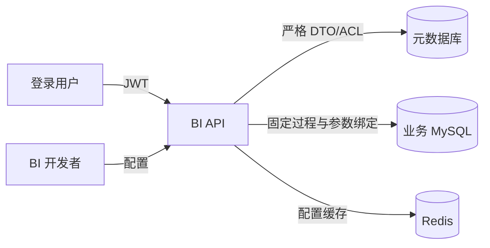

# 安全与运维设计

## 1. 安全边界

SK BI 同时连接系统元数据库和多个业务数据库，能够执行存储过程并返回企业数据，因此必须把“登录用户”“报表配置者”和“业务数据源”视为不同信任边界。



浏览器提交的 UUID、组件键、控件值、钻取 JSON、配置字段和请求版本全部是不可信输入。数据库返回的字段名、JSON 和样式字符串同样必须验证后才能输出或渲染。

## 2. 认证与身份

### 2.1 第一版本地登录

- 使用若依 Spring Security、JWT、用户和角色体系。
- JWT 通过若依约定的请求头传递，不允许放入 URL。
- 运行端和管理端均要求登录，匿名请求返回 401。
- 禁止将用户 ID、角色或 `p_user_id` 作为可由客户端信任的请求字段。

### 2.2 ERP 身份适配

预留 `ExternalIdentityProvider`，外部主体必须映射到内部用户记录：

```text
external_provider + external_subject -> internal_user_id
```

默认传给存储过程的是内部用户 ID。未来若业务过程必须使用 ERP 用户编号，应新增受控的系统参数来源，例如 `SYSTEM:erp_user_code`，不能改变现有 `SYSTEM:user_id` 的含义。

外部账号首次绑定、解绑、冲突处理和禁用必须进入审计日志。

## 3. 授权模型

### 3.1 三层校验

1. 若依功能权限：用户是否能进入数据源管理、报表设计、查看或导出功能。
2. 对象 ACL：用户或其角色是否被授予目标报表/数据源。
3. 数据行权限：存储过程是否基于服务端注入的 `p_user_id` 过滤业务数据。

三层均通过才允许相应操作。报表 ACL 不能代替数据库行级权限，UUID 不能代替任何权限。

### 3.2 ACL 判定

```text
allow = isSystemAdmin
     OR directUserGrant(reportId, userId)
     OR anyRoleGrant(reportId, userRoles)
```

- 未授权 UUID 对普通用户返回 404，减少资源枚举；已知但停用的报表也返回 404。
- 管理端可以对有诊断权限的管理员返回具体状态。
- 导出要求先通过查看权限，再通过 `bi:report:export`。
- 报表设计者只能选择其有使用权的数据源。

### 3.3 `p_user_id` 注入

- 参数绑定器只从 Spring Security 上下文取得内部用户 ID。
- 客户端传递名为 `p_user_id`、`userId` 或等价系统参数时不得覆盖，并记录一次安全事件。
- 保存参数映射时，`p_user_id` 默认且强制映射为 `SYSTEM:user_id`；`p_region_key` 和 `p_component_key` 只能从服务端当前配置注入。只有系统管理员可在明确警告下把用户参数映射到其他经过注册的系统身份属性。
- 日志只记录用户 ID 的不可逆哈希或内部 ID，不记录完整身份令牌。

## 4. 数据源凭据

### 4.1 加密存储

- 密码使用 AES-256-GCM 加密，主密钥通过环境变量 `BI_DATASOURCE_MASTER_KEY` 或外部密钥管理系统注入。
- 密文记录密钥版本、随机 nonce、ciphertext 和认证 tag；相同密码重复保存产生不同密文。
- 主密钥、明文密码、JDBC URL 和数据库用户名不写入日志、版本快照、Redis 或 API 响应。
- API 详情只返回 `hasPassword`，编辑密码留空表示不修改。
- 密钥轮换通过 `credential_version` 和后台批量重加密任务完成，旧密钥在迁移完成前只保留解密能力。

### 4.2 数据库账号权限

推荐业务账号：

- 对 `INFORMATION_SCHEMA.PARAMETERS` 具备必要读取能力；
- 只对被配置过程拥有 `EXECUTE`；
- 对控件选项涉及的表或视图拥有 `SELECT`；
- 不拥有 DDL、文件、管理、授权或写入权限；
- 存储过程优先使用 `SQL SECURITY INVOKER` 和 `READS SQL DATA`。

连接测试除了连通性，还应输出不包含敏感细节的权限警告。

## 5. 数据库执行安全

### 5.1 存储过程调用

- 过程名必须来自已保存配置并与数据库元数据精确匹配。
- `p_region_key` 根据目标对象固定为 `COMPONENT` 或 `TABLE`，`p_component_key` 根据 URL 中经过配置校验的对象键注入；客户端不能把表格请求伪装成组件区域请求。
- 生成 `{call schema.procedure(?,...)}` 时，schema 和过程标识符通过 MySQL 标识符引用函数处理，不能使用请求字符串。
- 所有值通过 `CallableStatement` 参数绑定。
- 执行前比较签名哈希，防止过程变更造成参数错位。
- 设置查询超时、结果行数、连接池超时和只读事务提示。
- 检测并拒绝第二个结果集、OUT/INOUT 和不支持的数据类型。

### 5.2 SQL 选项

- 使用 MySQL SQL 解析器确认单条 SELECT/CTE；禁止 DML、DDL、CALL、`INTO OUTFILE`、锁语句和多语句。
- 解析校验不能代替只读数据库权限。
- 只允许 `:currentUserId` 命名参数，并由服务端登录上下文绑定；客户端不能提交该值。
- 最多读取 1,001 行，仅返回前 1,000 行并标记截断。
- SQL 正文只对有编辑权限的开发者返回，不进入普通查看者的运行配置。
- SQL 修改必须进入配置版本和审计。

## 6. 输入与输出安全

### 6.1 请求限制

- 管理配置请求最大 5 MiB；运行查询请求最大 256 KiB；单个钻取 JSON 最大 32 KiB。
- 文本控件默认最大 1,000 字符，多选默认最多 500 项；可按控件调低，不可突破平台上限。
- UUID、组件键、路由编码和字段名使用长度与字符白名单。
- 日期、数字、布尔和 JSON 在调用数据库前完成强类型校验。

### 6.2 XSS 与样式

- 所有显示名称、标题、标签和数据值按文本渲染，不使用 `v-html`。
- ECharts tooltip formatter 使用受控函数处理转义，不执行配置字符串。
- 样式协议严格匹配 `#RRGGBB,(bold|normal)`，解析后只赋值 `color` 和 `fontWeight`。
- Excel 单元格以 `= + - @` 开头的字符串默认前置单引号，防止公式注入；明确配置为数字或日期的字段按对应类型写入。

### 6.3 响应数据

- 后端只输出当前路由配置引用的显示、载荷和样式字段。
- 错误响应不得包含 SQL、过程体、参数真实值、数据库主机、用户名、堆栈或结果样本。
- 诊断详情仅在服务端日志中以访问受控的结构化形式保存。

## 7. 资源保护

### 7.1 默认阈值

| 资源 | 默认值 | 平台上限 |
|---|---:|---:|
| 单组件返回行数 | 50,000 | 200,000 |
| 存储过程超时 | 60 秒 | 600 秒 |
| SQL 控件选项 | 1,000 | 1,000 |
| SQL 控件超时 | 10 秒 | 10 秒 |
| 单用户并发组件查询 | 4 | 可运维配置 |
| 单数据源并发查询 | 20 | 可运维配置 |
| 全实例并发查询 | 100 | 按内存与数据库容量调整 |

- 并发许可在取得数据库连接前申请，等待超过 5 秒返回 `BI_QUERY_BUSY`。
- 大结果集逐行读取到受控集合，读取第 `limit+1` 行后立即停止并尝试取消/关闭 statement。
- 响应启用 gzip/brotli 时必须评估 CPU；不压缩已经压缩的下载文件。
- JVM 堆和浏览器性能不以 200,000 行作为日常目标；平台硬上限只用于管理员批准的特殊报表。

## 8. 审计与日志

### 8.1 必审计操作

- 数据源创建、修改凭据、测试、停用、ACL 修改；
- 报表创建、保存、复制、启停、删除、ACL 修改和版本回滚；
- 存储过程参数同步和签名变化；
- 报表导出；
- 外部身份绑定和解绑；
- 越权访问、客户端尝试覆盖系统参数和重复查询限流。

### 8.2 查询日志字段

```text
traceId, requestId, userId, reportUuid, configVersion,
regionKey, componentKey, routeCode, datasourceId, procedureNameHash,
elapsedMs, rowCount, truncated, outcome, errorCode
```

不记录控件值、钻取 JSON 全文、结果行、密码和 JWT。定位业务问题确需采样时必须通过临时、审批、脱敏的诊断开关进行。

## 9. 监控指标

- `bi_query_total{outcome,component}`
- `bi_query_duration_seconds{datasource}`
- `bi_query_rows{datasource}`
- `bi_query_truncated_total{report}`
- `bi_query_timeout_total{datasource}`
- `bi_query_rejected_total{reason}`
- `bi_datasource_pool_active/idle/pending`
- `bi_config_cache_hit_total`、`bi_config_cache_miss_total`
- `bi_config_invalidation_delay_seconds`
- `bi_option_query_duration_seconds`

告警至少覆盖：数据源连续不可用、查询超时率升高、截断率异常、连接池耗尽、配置失效延迟超过 2 秒和 JVM 内存压力。

## 10. 配置与环境变量

```yaml
bi:
  query:
    default-max-rows: 50000
    hard-max-rows: 200000
    default-timeout-seconds: 60
    max-timeout-seconds: 600
    per-user-concurrency: 4
    per-datasource-concurrency: 20
    global-concurrency: 100
  option:
    max-rows: 1000
    timeout-seconds: 10
    cache-ttl-seconds: 60
  cache:
    report-ttl-minutes: 30
    invalidation-channel: bi:config:invalidate
```

敏感配置：

```text
BI_DATASOURCE_MASTER_KEY=<base64-encoded-256-bit-key>
```

生产环境启动时若缺少或不符合长度，应用必须失败启动，不能使用代码内默认密钥。

## 11. 备份与恢复

- 元数据库按企业标准执行全量加 binlog 增量备份；配置版本不自动清理。
- Redis 不是配置唯一来源，丢失后可从元数据库重建。
- 数据源主密钥必须独立备份并限制访问；没有密钥时数据源密码不可恢复。
- 恢复演练需验证报表 UUID、ACL、配置版本、快照哈希和加密凭据。
- 回滚配置不等于数据库灾备，不能替代元数据库备份。

## 12. 常见故障处理

| 故障 | 检查 | 处理 |
|---|---|---|
| 配置已保存但未生效 | 当前版本、Redis 键、失效消息延迟 | 删除指定 UUID 缓存并检查订阅，不重启作为常规方案 |
| 签名变化 | 参数元数据与保存哈希 | 在设计器重新同步并映射，禁止强行执行 |
| 单组件超时 | traceId、过程耗时、数据库执行计划 | 优化过程或缩小控件范围，不盲目提高全局超时 |
| 结果截断 | 行数指标、筛选条件 | 提示用户增加条件；特殊报表经评审调高限制 |
| 连接池耗尽 | 活跃连接、等待数、慢查询 | 限流、取消慢查询、检查连接泄漏和数据库容量 |
| 回滚失败 | 快照引用的数据源、过程和签名 | 恢复缺失依赖或选择可通过校验的版本 |
